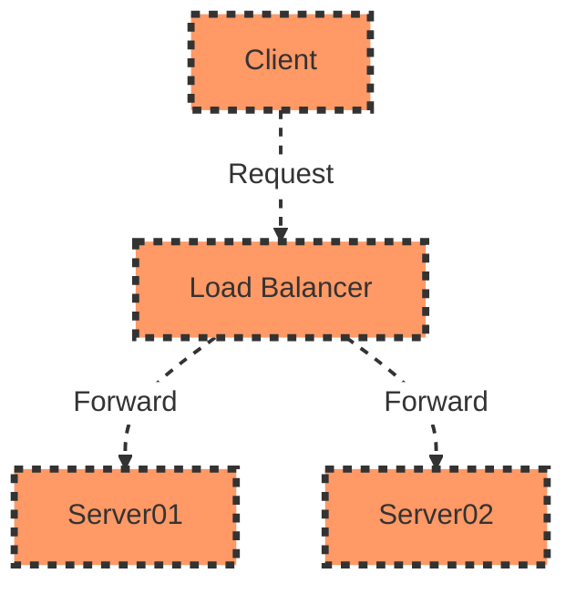

# test-repo

```mermaid
%%{init: {'theme': 'base', 'themeVariables': { 'primaryColor': '#ffcc00', 'edgeLabelBackground':'#ffffff', 'cssClass': 'highlight', 'highlightColor': '#ffcc00', 'hoverColor': '#ffcc00'}}}%%
graph TD
    A[Client] --> |Request| B[Load Balancer]
    B --> |Forward| C[Server01]
    B --> |Forward| D[Server02]
    classDef highlight fill:#f96,stroke:#333,stroke-width:4px,stroke-dasharray: 5 5;
    classDef hoverHighlight fill:#ffcc00,stroke:#333,stroke-width:4px,stroke-dasharray: 5 5;
    linkStyle 0,1,2 stroke-width:2px,fill:none,stroke:#333,stroke-dasharray: 5 5;
    class A,B,C,D highlight;

```
